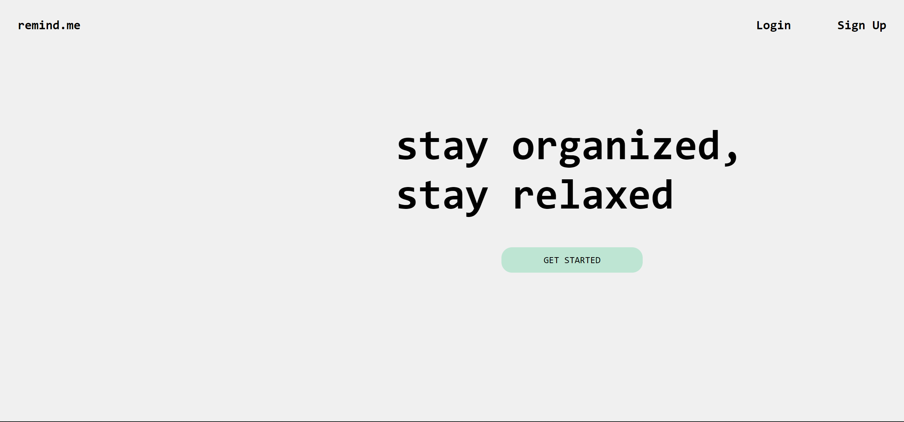
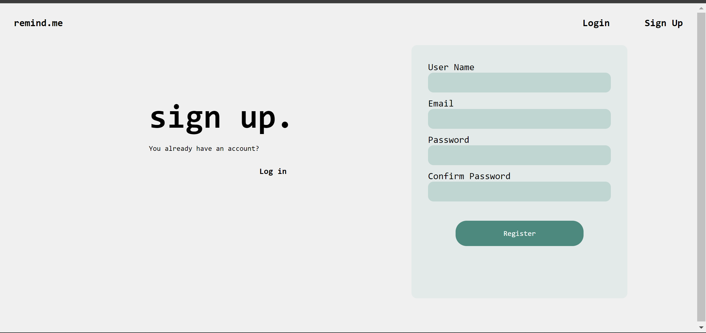
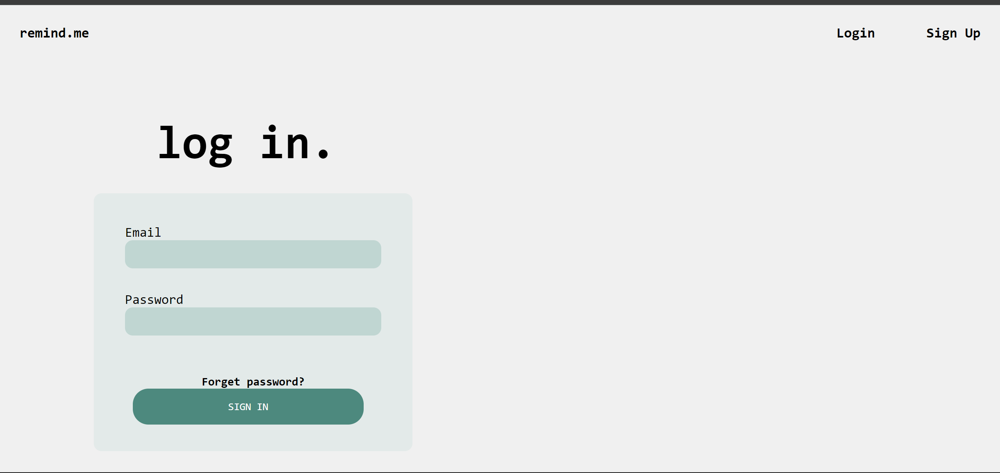
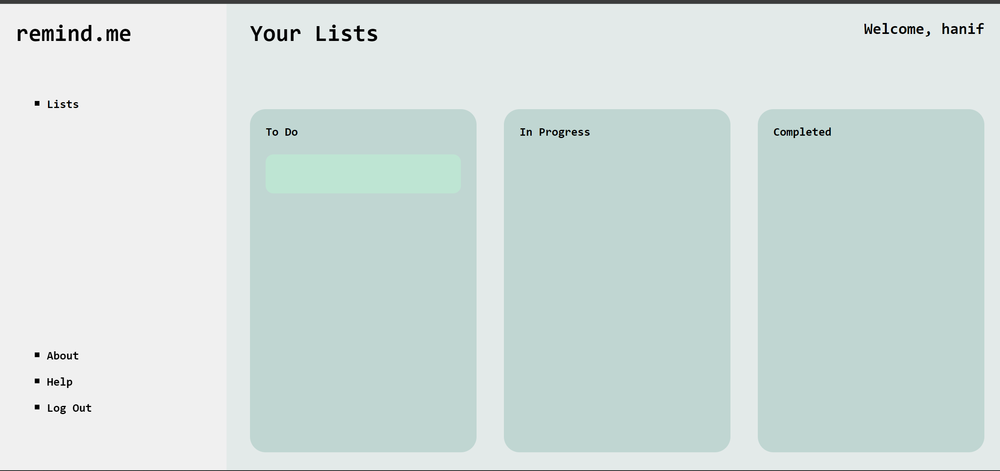

<h1>Remind.me</h1>

``remind.me`` is a Todo app that is built using "PHP" as the backend language. it includes Laravel-like router, controller classes, views and a project structure using namespace and PSR-4 autoloading. it showcases how to build a ``PHP`` project without using any frameworks.

## Usage

# Requirements

- PHP 8.0 or higher
- MYSQL 5.8 or higher

# Installation

1. Clone the repo into your document root(www, htdocs, etc)
2. Create a database called ``reminddb``
3. Import the ``reminddb.sql`` file into your database
4. Create your own ``.env`` file and make use of ``.env.example`` to know what to use
5. Run ``composer install`` to set up autoloading and also to install dependencies
6. Set your document root to the ``public`` directory

# Setting the document Root

You will need to set your document root to the public directory 

<h4>PHP bulit-in server</h4>

``php -S localhost:8000 -t public``

